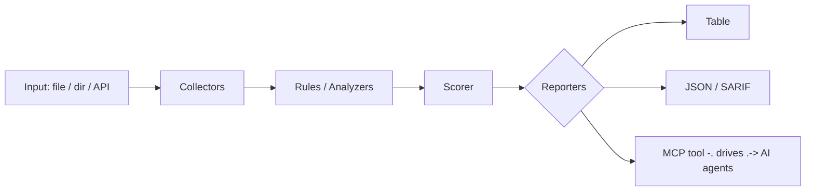

<a name="top"></a>
<div align="center">


# TXGRAPH

### Builds a transaction graph from ledger/account data and surfaces structuring, layering, and mule-network patterns for AML triage.


[](#install--every-way-every-platform) [](https://github.com/cognis-digital/txgraph/actions) [](LICENSE) [](https://github.com/cognis-digital)

*Fintech & Payments Security — PCI, fraud, AML, and payment rails.*

</div>

```bash
pip install "git+https://github.com/cognis-digital/txgraph.git"
txgraph scan .            # → prioritized findings in seconds
```

<!-- cognis:layman:start -->
## What is this?

txgraph reads a spreadsheet of financial transactions and automatically flags suspicious money patterns — like someone breaking a large payment into several smaller ones to dodge reporting limits (structuring), funds bouncing through a chain of accounts to hide their origin (layering), or accounts that collect money from many sources and quickly pass it on (money mule networks). You run one command pointing at your CSV file and get a plain-English report of what looks fishy, along with a SAR (Suspicious Activity Report) summary ready for compliance review. It is aimed at compliance analysts, fraud investigators, and developers who need a fast, scriptable way to screen transaction data for anti-money-laundering red flags without standing up a database or cloud service.
<!-- cognis:layman:end -->

## Contents

- [Why txgraph?](#why) · [Features](#features) · [Quick start](#quick-start) · [Example](#example) · [Architecture](#architecture) · [AI stack](#ai-stack) · [How it compares](#how-it-compares) · [Integrations](#integrations) · [Install anywhere](#install-anywhere) · [Related](#related) · [Contributing](#contributing)

<a name="why"></a>
## Why txgraph?

Graph-based money-laundering detection is academically hot but has no plug-and-play CLI; ingest CSV, emit suspicious subgraphs + SAR-ready summaries with zero infra is a viral AML demo.

`txgraph` is single-purpose, scriptable, and self-hostable: point it at a target, get prioritized results in the format your workflow already speaks (table · JSON · SARIF), gate CI on it, and let agents drive it over MCP.

<div align="right"><a href="#top">↑ back to top</a></div>

<a name="features"></a>
## Features

- ✅ Load Transactions
- ✅ Build Graph
- ✅ Detect Structuring
- ✅ Detect Layering
- ✅ Detect Mules
- ✅ Analyze
- ✅ Sar Summary
- ✅ Runs on Linux/macOS/Windows · Docker · devcontainer
- ✅ Ports in Python, JavaScript, Go, and Rust (`ports/`)

<div align="right"><a href="#top">↑ back to top</a></div>

<a name="quick-start"></a>
<!-- cognis:domains:start -->
## Domains

**Primary domain:** Finance & Quant  ·  **JTF MERIDIAN division:** BLACKBOOK · ORACLE

**Topics:** `cognis` `finance` `fintech` `quant`

Part of the **Cognis Neural Suite** — 300+ source-available tools organized across 12 domains under the JTF MERIDIAN command structure. See the [suite on GitHub](https://github.com/cognis-digital) and [jtf-meridian](https://github.com/cognis-digital/jtf-meridian) for how the pieces fit together.
<!-- cognis:domains:end -->

<!-- cognis:install:start -->
## Install

`txgraph` is source-available (not published to PyPI) — every method below installs
straight from GitHub. Pick whichever you prefer; the one-line scripts auto-detect
the best tool available on your machine.

**One-liner (Linux / macOS):**
```sh
curl -fsSL https://raw.githubusercontent.com/cognis-digital/txgraph/HEAD/install.sh | sh
```

**One-liner (Windows PowerShell):**
```powershell
irm https://raw.githubusercontent.com/cognis-digital/txgraph/HEAD/install.ps1 | iex
```

**Or install manually — any one of:**
```sh
pipx install "git+https://github.com/cognis-digital/txgraph.git"     # isolated (recommended)
uv tool install "git+https://github.com/cognis-digital/txgraph.git"  # uv
pip install "git+https://github.com/cognis-digital/txgraph.git"      # pip
```

**From source:**
```sh
git clone https://github.com/cognis-digital/txgraph.git
cd txgraph && pip install .
```

Then run:
```sh
txgraph --help
```
<!-- cognis:install:end -->

## Quick start

```bash
pip install "git+https://github.com/cognis-digital/txgraph.git"
txgraph --version
txgraph scan .                       # scan current project
txgraph scan . --format json         # machine-readable
txgraph scan . --fail-on high        # CI gate (non-zero exit)
```

<div align="right"><a href="#top">↑ back to top</a></div>

<a name="example"></a>
## Example

```text
$ txgraph scan .
  [HIGH    ] TXG-001  example finding             (./src/app.py)
  [MEDIUM  ] TXG-002  another signal              (./config.yaml)

  2 findings · risk score 5 · 38ms
```

<div align="right"><a href="#top">↑ back to top</a></div>

<a name="architecture"></a>
## Architecture



<div align="right"><a href="#top">↑ back to top</a></div>

<a name="ai-stack"></a>
## Use it from any AI stack

`txgraph` is interoperable with every popular way of using AI:

- **MCP server** — `txgraph mcp` (Claude Desktop, Cursor, Cognis.Studio, [uncensored-fleet](https://github.com/cognis-digital/uncensored-fleet))
- **OpenAI-compatible / JSON** — pipe `txgraph scan . --format json` into any agent or LLM
- **LangChain · CrewAI · AutoGen · LlamaIndex** — wrap the CLI/JSON as a tool in one line
- **CI / scripts** — exit codes + SARIF for non-AI pipelines

<div align="right"><a href="#top">↑ back to top</a></div>

<a name="how-it-compares"></a>
## How it compares

| | **Cognis txgraph** | AMLSim |
|---|:---:|:---:|
| Self-hostable, no account | ✅ | varies |
| Single command, zero config | ✅ | ⚠️ |
| JSON + SARIF for CI | ✅ | varies |
| MCP-native (AI agents) | ✅ | ❌ |
| Polyglot ports (JS/Go/Rust) | ✅ | ❌ |
| Open license | ✅ COCL | varies |

*Built in the spirit of **AMLSim / Neo4j fraud graph**, re-framed the Cognis way. Missing a credit? Open a PR.*

<div align="right"><a href="#top">↑ back to top</a></div>

<a name="integrations"></a>
## Integrations

Pipes into your stack: **SARIF** for code-scanning, **JSON** for anything, an **MCP server** (`txgraph mcp`) for AI agents, and a webhook forwarder for SIEM/Slack/Jira. See [`docs/INTEGRATIONS.md`](docs/INTEGRATIONS.md).

<div align="right"><a href="#top">↑ back to top</a></div>

<a name="install-anywhere"></a>
## Install — every way, every platform

```bash
pip install "git+https://github.com/cognis-digital/txgraph.git"    # pip (works today)
pipx install "git+https://github.com/cognis-digital/txgraph.git"   # isolated CLI
uv tool install "git+https://github.com/cognis-digital/txgraph.git" # uv
pip install cognis-txgraph                                          # PyPI (when published)
docker run --rm ghcr.io/cognis-digital/txgraph:latest --help        # Docker
brew install cognis-digital/tap/txgraph                             # Homebrew tap
curl -fsSL https://raw.githubusercontent.com/cognis-digital/txgraph/main/install.sh | sh
```

| Linux | macOS | Windows | Docker | Cloud |
|---|---|---|---|---|
| `scripts/setup-linux.sh` | `scripts/setup-macos.sh` | `scripts/setup-windows.ps1` | `docker run ghcr.io/cognis-digital/txgraph` | [DEPLOY.md](docs/DEPLOY.md) (AWS/Azure/GCP/k8s) |

<div align="right"><a href="#top">↑ back to top</a></div>

<a name="related"></a>
<a name="verification"></a>
## Verification

[](AUDIT.md)

Every push is verified end-to-end. Latest audit (2026-06-13):

```text
tests        : 14 passed, 0 failed, 0 errored
compile      : all modules parse
cli          : C:\Python314\python.exe: No module named https
package      : https
```

<details><summary>CLI surface (<code>--help</code>)</summary>

```text
C:\Python314\python.exe: No module named https
```
</details>

Full machine-readable results: [`AUDIT.md`](AUDIT.md) · regenerate with `python -m https --help` + `pytest -q`.

<div align="right"><a href="#top">↑ back to top</a></div>


## Related Cognis tools

- [`panhound`](https://github.com/cognis-digital/panhound) — Scans code, logs, fixtures, and S3 buckets for leaked PANs (Luhn-validated card numbers) and CVVs before they hit prod.
- [`fraudlens`](https://github.com/cognis-digital/fraudlens) — Replays a stream of transactions against pluggable fraud rules and ML scorers, emitting precision/recall and alert volume from the terminal.
- [`obscan`](https://github.com/cognis-digital/obscan) — Conformance and security linter for Open Banking / FAPI APIs: validates OAuth flows, consent scopes, and PSD2 endpoints against the spec.
- [`ledgerproof`](https://github.com/cognis-digital/ledgerproof) — Verifies double-entry ledger integrity and tamper-evidence by checking balance invariants and hash-chained journal entries.
- [`iso20022`](https://github.com/cognis-digital/iso20022) — Validates, lints, and diffs ISO 20022 / pacs / camt payment messages and translates legacy MT into MX with schema-aware errors.
- [`tokenvault`](https://github.com/cognis-digital/tokenvault) — Self-hostable PCI tokenization microservice and CLI that swaps PANs for format-preserving tokens and proves no raw card data persists.

**Explore the suite →** [🗂️ all 170+ tools](https://github.com/cognis-digital/cognis-neural-suite) · [⭐ awesome-cognis](https://github.com/cognis-digital/awesome-cognis) · [🔗 cognis-sources](https://github.com/cognis-digital/cognis-sources) · [🤖 uncensored-fleet](https://github.com/cognis-digital/uncensored-fleet) · [🧠 engram](https://github.com/cognis-digital/engram)

<div align="right"><a href="#top">↑ back to top</a></div>

<a name="contributing"></a>
## Contributing

PRs, new rules, and demo scenarios are welcome under the collaboration-pull model — see [CONTRIBUTING.md](CONTRIBUTING.md) and [SECURITY.md](SECURITY.md).

> ### ⭐ If `txgraph` saved you time, **star it** — it genuinely helps others find it.

## License

Source-available under the **Cognis Open Collaboration License (COCL) v1.0** — free for personal, internal-evaluation, research, and educational use; **commercial / production use requires a license** (licensing@cognis.digital). See [LICENSE](LICENSE).

---

<div align="center"><sub><b><a href="https://cognis.digital">Cognis Digital</a></b> · one of 170+ tools in the <a href="https://github.com/cognis-digital/cognis-neural-suite">Cognis Neural Suite</a> · <i>Making Tomorrow Better Today</i></sub></div>
